# Dual-Tier OCR Document Processing & Classification Pipeline
## Master Technical Specification & Architecture Manual

> **Stack:** FastAPI · Tesseract OCR · PyMuPDF · OpenCV · OpenAI GPT-4o · Redis · Karate · Gatling · Trivy DevSecOps

---

## 🗺 System Architecture Overview

This repository uses a professional **dual-tier architecture** designed to balance rapid, cost-effective architectural testing with high-fidelity production document processing.

```mermaid
graph TD
    subgraph Root [Tier 1: Architectural Mock Simulation]
        A[Client] -->|Upload File| B[Mock API Router]
        B -->|Queue Job| C[In-Memory Mock Processor]
        C -->|Poll Result| D[In-Memory Store]
    end

    subgraph OCR [Tier 2: Production-Grade OCR & AI Pipeline]
        E[Client] -->|1. Validate File| F[Input Service]
        F -->|2. Convert PDF to Pixels| G[PyMuPDF & OpenCV]
        G -->|3. Extract Text| H[Tesseract OCR Engine]
        H -->|4. Structure & Clean| I[Postprocess Service]
        I -->|5. Regex & Keyword Matches| J[Rule-Based Classifier]
        J -->|6. GPT-4o Fallback| K[OpenAI LLM Service]
        K -->|7. Persist Result| L[Redis Result Store]
    end
```



---

## 📁 Repository Directory Topology

The project is split into two independent work directories to separate the mock environment from the production engine:

```text
.
├── .gitignore                      ← Root git exclusion profile (scrubbed of envs & caches)
├── .trivyignore                    ← Root security scanning exclusion rules
├── Dockerfile                      ← Dockerfile for Mock API Simulation
├── Dockerfile.karate               ← Dockerfile for Mock Karate Testing Suite
├── docker-compose.yml              ← Compose orchestrator for Mock Simulation
├── karate-tests/                   ← Functional test cases for Mock Simulation
├── readme_1.md                     ← Overview of the Dual-Tier architecture
├── readme_2.md                     ← [THIS FILE] Ultimate Master Documentation
├── src/                            ← Python codebase for Mock API Simulation
│   ├── main.py                     ← Simulated FastAPI Router
│   ├── models/                     ← Simulated Pydantic models
│   ├── services/                   ← Simulated processing & mock LLM state
│   └── utils/                      ← Logger utilities
│
└── ocr_pipeline/                   ← PRODUCTION OCR & CLASSIFICATION ENGINE
    ├── .dockerignore
    ├── .env.example                ← Template configuration (OPENAI, REDIS)
    ├── .trivyignore                ← Security exclusions for production OCR
    ├── Dockerfile                  ← Multi-stage production container (OpenCV + Tesseract)
    ├── README.md                   ← Production README & local setup guide
    ├── config.py                   ← Pydantic configuration loader
    ├── docker-compose.yml          ← Compose orchestrator for Production + Karate
    ├── generate_testdata.py        ← Utility to compile PDF fixtures for Karate
    ├── main.py                     ← Production FastAPI Application
    ├── scan-security.ps1           ← Local Trivy scan script for Windows PowerShell
    ├── scan-security.sh            ← Local Trivy scan script for Linux / Git-Bash
    ├── .github/workflows/          
    │   └── qa.yml                  ← CI/CD pipeline integrating Karate, Gatling, and Trivy
    ├── models/                     ← Production response schemas & Enums
    ├── services/                   
    │   ├── input_service.py        ← File validation (Size, MIME, page count limits)
    │   ├── ocr_service.py          ← PyMuPDF extraction -> OpenCV grayscaling -> Tesseract
    │   ├── postprocess_service.py  ← Text garbage cleanup
    │   ├── classifier_service.py   ← Strict Keyword & Regex keyword match rules
    │   └── llm_service.py          ← Real OpenAI GPT-4o + dynamic dry-run fallback
    ├── store/                      
    │   └── result_store.py         ← Redis datastore + local fallback memory-dict
    └── tests/karate/               ← Complete production QA features & Gatling tests
```

---

## 🧱 Tier 1: Mock Architectural Simulation (Root Workspace)

### Purpose
Allows instant, zero-cost verification of API routers, schema contracts, CI/CD integrations, and Karate testing frameworks without paying for OpenAI API tokens or setting up local Tesseract / Redis system dependencies.

### Key Components
- **`src/main.py`**: Fast-booting FastAPI server serving `/api/v1/upload`, `/api/v1/process/{job_id}`, `/api/v1/classify/{job_id}`, and `/api/v1/result/{job_id}`.
- **`karate-tests/`**: Functional test suites checking basic state transformations (QUEUED $\rightarrow$ PROCESSED $\rightarrow$ CLASSIFIED).

### How to Run Locally

1. **Launch the mock pipeline using Docker Compose**:
   ```bash
   docker-compose up --build
   ```
   This starts the Mock API and runs the Karate test suite against it inside ephemeral container networks.

---

## ⚡ Tier 2: Production OCR & AI Engine (`ocr_pipeline/`)

This is the robust, production-grade core of the project. It handles real scanned PDF uploads, performs Optical Character Recognition (OCR), and classifies documents using strict keyword rules or OpenAI's GPT-4o model.

### ⚙ The 5-Stage Processing Pipeline

```text
[PDF Upload] ──> (1. Input Validate) ──> (2. Computer Vision / OCR) ──> (3. Postprocessing) ──> (4. Rules Classifier) ──> (5. AI Fallback)
```

#### 1. Input Validation (`input_service.py`)
- Restricts files to **PDF** (MIME type checked).
- Enforces strict size ceilings (default: **20 MB**).
- Validates page count (prevents parsing excessively long documents to control API/compute costs).

#### 2. Computer Vision & OCR (`ocr_service.py`)
- **Document Loading**: PyMuPDF converts PDF pages into high-fidelity image buffers.
- **OpenCV Enhancement**: Applies image pre-processing (converts to grayscaling, scales up, and applies adaptive thresholding) to dramatically increase Tesseract OCR accuracy on poor, noisy scans.
- **OCR Engine**: Feeds treated buffers directly into the `Tesseract OCR` engine using Python wrappers.

#### 3. Post-processing (`postprocess_service.py`)
- Strips excess carriage returns, resolves broken hyphenations, normalizes whitespaces, and removes artifacts to prepare clean string blocks for classification.

#### 4. Rule-Based Classification (`classifier_service.py`)
Matches clean text against strict regular expression structures and keyword profiles:
- **`INVOICE`**: invoice, total, amount due, VAT, payment terms
- **`IDENTITY`**: passport, date of birth, nationality, DNI
- **`REPORT`**: executive summary, findings, conclusion, methodology
- **`CONTRACT`**: agreement, parties, clause, termination, whereas

#### 5. LLM Fallback Classification (`llm_service.py`)
If rule-based filters return `UNCLASSIFIED`, the document text is forwarded to **OpenAI GPT-4o**.
- Uses custom system instructions to extract core semantic fields and return strict labels.
- Includes a togglable **`MOCK_LLM=true`** mode to return dummy classifications without making live external API requests.

---

## 🧪 Comprehensive QA & Performance Testing

The project uses a unified Maven-based testing architecture combining **Karate DSL** for functional integration testing and **Gatling** for asynchronous load simulation.

### Asynchronous State Polling in Karate
Since document processing is asynchronous and stateful, the Karate tests utilize a robust polling engine to fetch results:
1. Upload a PDF $\rightarrow$ Receive `job_id` (status: `QUEUED`).
2. Trigger processing & classification.
3. Poll `/api/v1/result/{job_id}` in a loop until `JobStatus` becomes `CLASSIFIED` or `FAILED`.
4. Run strict JSON Schema validations against the final payload.

### Running Functional Integration Tests
1. Generate fresh local PDF mock templates:
   ```bash
   python generate_testdata.py
   ```
2. Run functional Karate tests:
   ```bash
   cd tests/karate
   mvn test
   ```

### Asynchronous Load Testing (Gatling)
Validates that the pipeline can satisfy performance targets under heavy concurrent load (e.g., 20 concurrent uploaders, p95 latencies under thresholds).
- Run performance simulations:
  ```bash
  mvn gatling:test
  ```
- **Performance targets**:
  - Upload p95: `< 2,000 ms`
  - Processing p95: `< 8,000 ms`
  - Success Rate: `> 95%`

---

## 🛡 DevSecOps & Security (Trivy Integration)

We have integrated a world-class DevSecOps pipeline using **Trivy** to cover filesystem, Infrastructure as Code, secret leaking, and container image security.

### 1. CI/CD Pipeline Scan (`qa.yml`)
Every push and pull request initiates the **`security-scans`** job in GitHub Actions:
- **`trivy fs`**: Scans workspace libraries (`requirements.txt`, Maven dependencies), secrets, and configurations for misconfigurations.
- **Docker Image Scan**: Builds the local Docker image and scans it directly (`trivy image`) for OS-level vulnerabilities.
- **Failure Policy**: Automatically fails the build (`exit-code: 1`) on **HIGH** or **CRITICAL** severity issues.

### 2. Local Scanning Scripts
Developers can run exactly the same checks locally using temporary Docker containers, preventing the need to install Trivy locally.

- **On Windows (PowerShell)**:
  ```powershell
  cd ocr_pipeline
  .\scan-security.ps1
  ```
- **On Linux / WSL / Git Bash**:
  ```bash
  cd ocr_pipeline
  ./scan-security.sh
  ```

### 3. Exclusion Management (`.trivyignore`)
To gracefully handle acceptable risks or environment-specific rules (like allowing the ephemeral test container to run under a root user), a master `.trivyignore` file is situated at both the root and subdirectory levels to manage security rule bypasses cleanly:
```text
# Exclude DS-0002 (Running as root user in dev/test ephemeral containers)
DS-0002
```
